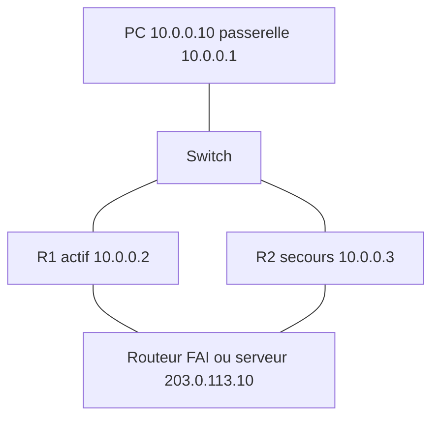

# Lab Cisco : redondance de passerelle avec HSRP

> **Statut : à réaliser.** Ce guide est préparé à partir de la documentation officielle et de mes cours ; **je ne l'ai pas encore rejoué de bout en bout**. Les commandes sont à valider en le faisant, et le journal en bas de page sera complété avec mes résultats réels (captures, erreurs rencontrées, corrections).

## Objectif

Éviter que la panne d'un routeur coupe l'accès à internet : deux routeurs partagent une **adresse IP virtuelle** (la passerelle des PC) grâce à **HSRP** (*Hot Standby Router Protocol*). Si le routeur actif tombe, l'autre prend le relais sans que les PC changent de configuration.

## Prérequis

- Cisco Packet Tracer (deux routeurs 2911 ou 4331, un switch).
- Notions : passerelle par défaut, ARP.

## Topologie



| Élément | Adresse |
|---|---|
| Passerelle virtuelle HSRP | 10.0.0.1 |
| R1 (g0/0) | 10.0.0.2/24, priorité 110 |
| R2 (g0/0) | 10.0.0.3/24, priorité 100 (défaut) |
| Le PC | 10.0.0.10/24, passerelle **10.0.0.1** |

## Étapes

### 1. R1 : routeur actif

Fichier du dépôt : [`configs/R1.txt`](configs/R1.txt)

```text
enable
configure terminal
hostname R1
interface g0/0
 ip address 10.0.0.2 255.255.255.0
 standby version 2
 standby 1 ip 10.0.0.1
 standby 1 priority 110
 standby 1 preempt
 no shutdown
end
write memory
```

### 2. R2 : routeur de secours

Fichier du dépôt : [`configs/R2.txt`](configs/R2.txt)

```text
enable
configure terminal
hostname R2
interface g0/0
 ip address 10.0.0.3 255.255.255.0
 standby version 2
 standby 1 ip 10.0.0.1
 standby 1 priority 100
 standby 1 preempt
 no shutdown
end
write memory
```

Le routeur ayant la **priorité la plus haute** devient actif. `preempt` lui permet de **reprendre** le rôle actif quand il revient après une panne (sans lui, le secours reste actif tant qu'il n'est pas lui-même en panne).

### 3. Surveiller une liaison montante (facultatif)

Si le lien vers internet de R1 tombe alors que R1 reste allumé, HSRP ne le voit pas : R1 reste actif et le trafic est perdu. La commande `standby 1 track` fait baisser la priorité de R1 dans ce cas :

```text
interface g0/0
 standby 1 track GigabitEthernet0/1 20
```

Avec 110 - 20 = 90 < 100, R2 devient actif. La configuration est à adapter à l'interface montante réelle.

## Vérifications

```text
show standby brief      ! sur R1 : état Active ; sur R2 : Standby
ping 10.0.0.1           ! depuis le PC
ping -t 203.0.113.10    ! depuis le PC, en continu, pendant la panne simulée
```

**Test de basculement** : lancer le ping continu, puis `shutdown` sur `g0/0` de R1. Noter le nombre de paquets perdus (« Request timed out »), vérifier avec `show standby brief` sur R2 (état Active). Puis `no shutdown` sur R1 : avec `preempt`, R1 redevient actif.

## Pièges fréquents

- Les PC n'utilisent pas l'adresse virtuelle comme passerelle : le basculement ne sert à rien.
- Versions HSRP différentes (`standby version 2` sur un routeur seulement) : les routeurs ne se voient pas.
- Numéros de groupe différents (`standby 1` et `standby 2`) : deux groupes indépendants qui s'ignorent.
- Adresse virtuelle qui fait partie d'un autre sous-réseau que les interfaces.

## Pour aller plus loin

- Comparer avec **VRRP** (standard ouvert) et **GLBP** (équilibrage de charge).
- Faire deux groupes HSRP (VLAN 10 et VLAN 20) avec des routeurs actifs inversés pour répartir la charge.
- Authentifier les messages HSRP : `standby 1 authentication md5 key-string <secret>`.
- Coupler avec le lab de routage entre VLAN : [lab-cisco-inter-vlan-router-on-a-stick](https://github.com/mehdiseg/lab-cisco-inter-vlan-router-on-a-stick).

## Références

- [RFC 2281 : Cisco Hot Standby Router Protocol](https://www.rfc-editor.org/rfc/rfc2281)
- [RFC 5798 : Virtual Router Redundancy Protocol version 3](https://www.rfc-editor.org/rfc/rfc5798)

## Journal de réalisation

_Lab pas encore réalisé : cette section sera remplie au fur et à mesure._

| Date | Ce que j'ai fait | Résultat | Difficultés et solutions |
|---|---|---|---|
|  |  |  |  |

## Feuille de route

Ce lab fait partie de ma [feuille de route réseau](https://github.com/mehdiseg/roadmap-reseau-bts-sio).

## Licence

[MIT](LICENSE)
